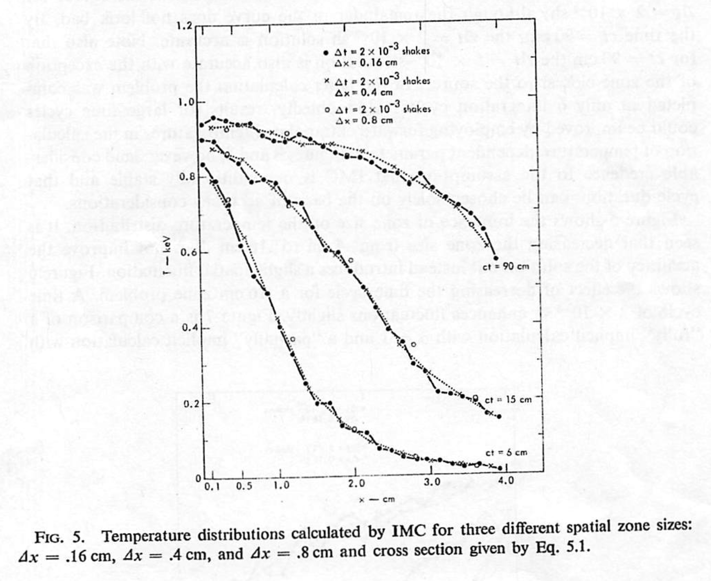

fcimc
=====

Python and Fortran implementations of Fleck and Cummings's implicit Monte Carlo
(IMC) scheme, published in Journal of Computational Physics (JCP) in 1971.

For each implementation, the results from the published paper (Fleck and
Cummings 1971) are reproduced via a set of predefined runs included in the
repository.

<table>
  <tr>
    <th>Fleck and Cummings (1971)</th>
    <th>Fortran implementation</th>
    <th>Python implementation</th>
  <tr>
    <td></td>
    <td></td>
    <td></td>
  </tr>
  <tr>
    <td></td>
    <td></td>
    <td></td>
  </tr>
  <tr>
    <td></td>
    <td></td>
    <td></td>
  </tr>
  <tr>
    <td></td>
    <td></td>
    <td></td>
  </tr>
  <tr>
    <td></td>
    <td></td>
    <td></td>
  </tr>
</table>

## Dependencies

### Python implementation

- Python 3
- Numpy

### Fortran implementation

- GFortran

### Bundled calculations

- Matplotlib
- Jupyter

### Documentation

For Doxygen:

- Doxygen
- Graphviz
- Doxypypy
- LaTeX
- ghp-import

The local `py_filter` script must be on the `$PATH`.

## Installation

To create a Conda env with the necessary dependencies:

    conda env create -f environment.yml
    conda activate fcimc

Add `py_filter` to the `$PATH`:

    export PATH=".:${PATH}"

## Usage

### Execution

To build and run everything from scratch, run the top-level script:

    ./runall clobber  # Removes latest graphs
    ./runall

To see the aggregated output:

    jupyter notebook verification.ipynb

To open the documentation:

    open docs/html/index.html

### Cleaning

To clean up intermediate build files etc.:

    ./runall clean

and to clean out everything (output files, executables, etc.) for a clean start:

    ./runall clobber

### Fine control

Each part of the project has its own `Makefile` which can be invoked directly:

    ./fortran/src/Makefile
    ./fortran/calcs/Makefile
    ./python/calcs/Makefile
    ./docs/Makefile

to either clean up one part, e.g.:

    make -C fortran/src clean
    make -C docs clobber

or build/execute, e.g.:

    make -C python/calcs -j 4 all

Building the documentation is a special case:

    PATH="$PWD/docs:$PATH" make -C docs html

which makes the `py_filter` command available.

### GitHub Pages

The `html` docs produced by Doxygen can be uploaded to GitHub Pages with:

    make -C docs github

(This step is _not_ run by `runall`.) This uses `ghp-import` to commit the
built documentation to a branch called `gh-pages`, and push this to GitHub. If
the GitHub repository is configured correctly then the `gh-pages` branch will
be rendered as a static site at `https://<user>.github.io/fcimc`.

### Ford docs

To build the Ford documentation:

    ford ford.md

The configuration is in `fpm.toml`.

## Verification

Run the Jupyer notebook to plot the results:

    jupyter notebook verification.ipynb

Verification against the original Fleck and Cummings (1971) results (shown on the left)
of both a Fortran (middle) and a Python (right) implementation of the IMC scheme
described therein.

